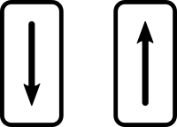
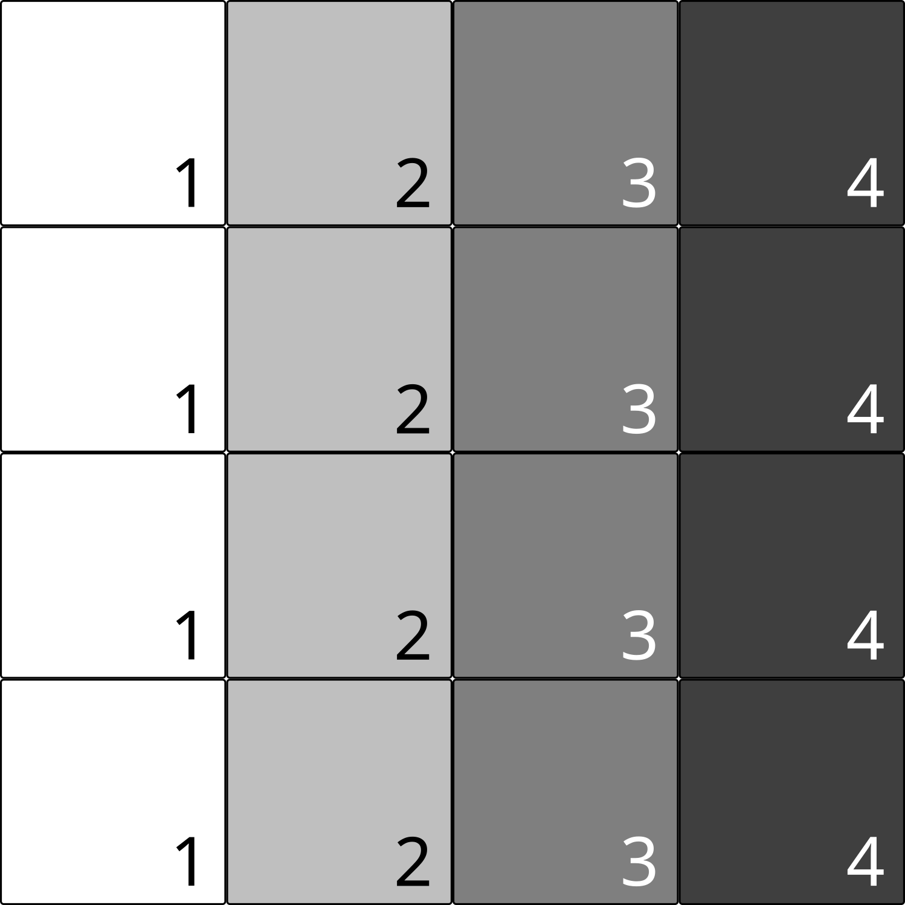
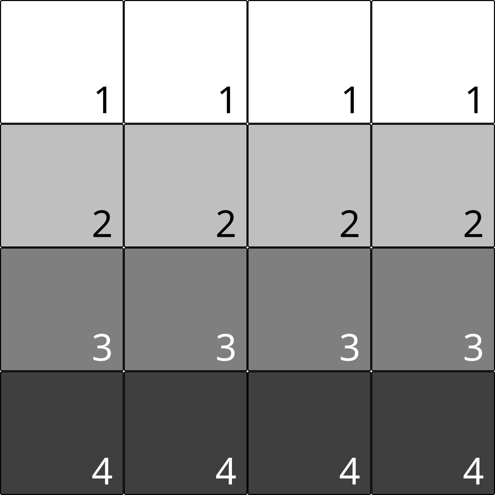
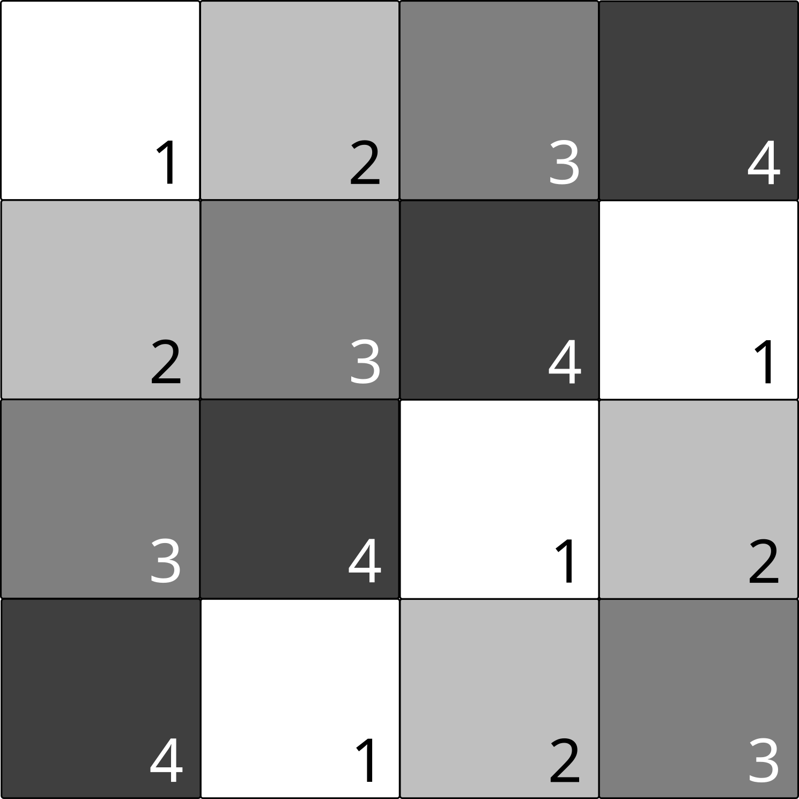
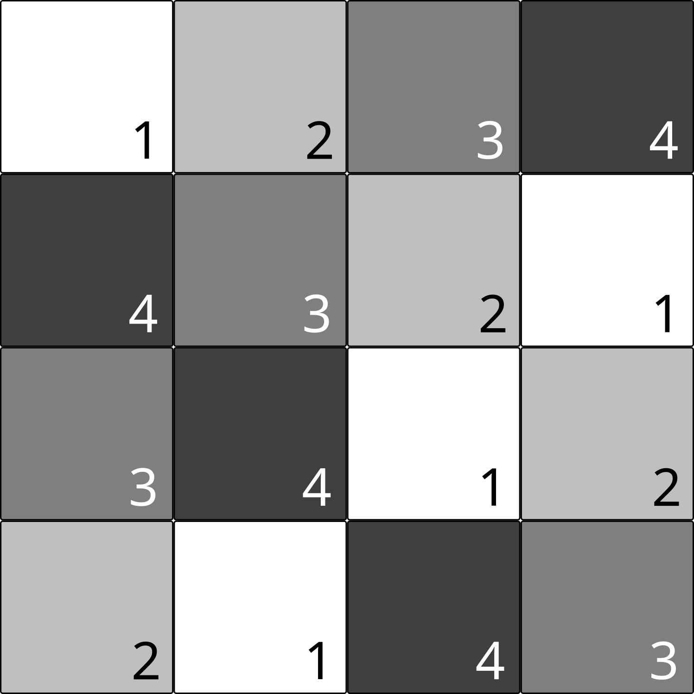
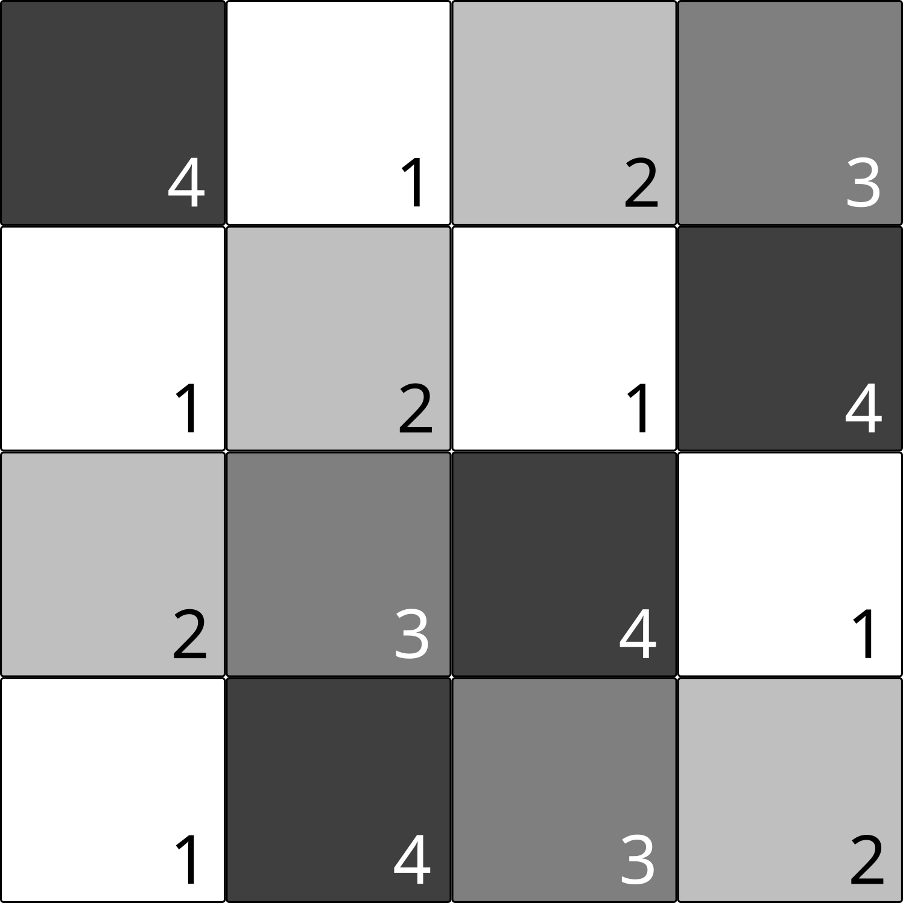
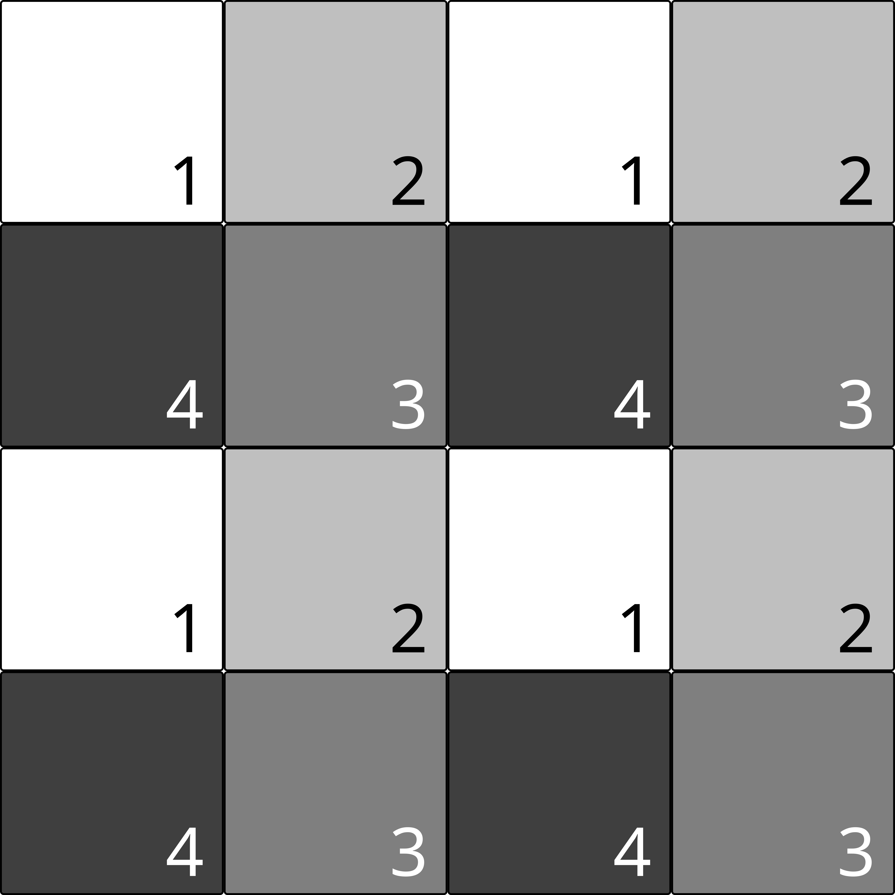
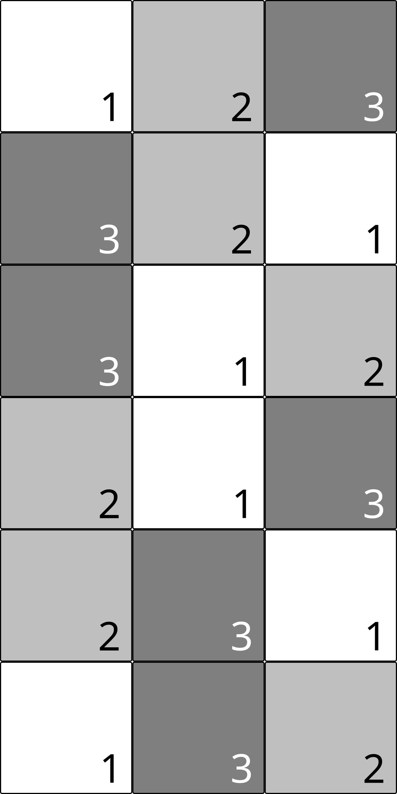
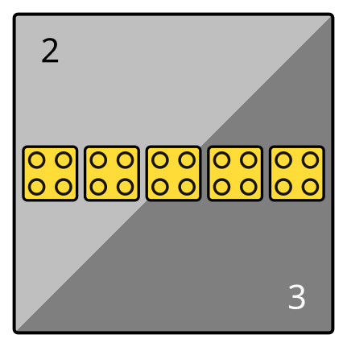

# *fiction* &ndash; Design Automation for Field-coupled Nanotechnologies

[](https://github.com/cda-tum/fiction/actions/workflows/ubuntu.yml)
[](https://github.com/cda-tum/fiction/actions/workflows/macos.yml)
[](https://github.com/cda-tum/fiction/actions/workflows/windows.yml)
[](https://github.com/cda-tum/fiction/actions/workflows/codeql-analysis.yml)
[](https://github.com/cda-tum/fiction/actions/workflows/docker-image.yml)
[](https://fiction.readthedocs.io/)
[](https://codecov.io/gh/cda-tum/fiction)
[](https://github.com/cda-tum/fiction/blob/main/LICENSE.txt)
[](https://github.com/cda-tum/fiction/releases)
[](https://arxiv.org/abs/1905.02477)

<p align="center">
  <picture>
    <source media="(prefers-color-scheme: dark)" srcset="docs/_static/mnt_light.svg" width="60%">
    
  </picture>
</p>

This code base provides a framework for **fi**eld-**c**oupled **t**echnology-**i**ndependent **o**pen **n**anocomputing
developed as part of the _Munich Nanotech Toolkit_ (_MNT_) by
the [Chair for Design Automation](https://www.cda.cit.tum.de/)
at the [Technical University of Munich](https://www.tum.de/). It is written in C++17 using the
[EPFL Logic Synthesis Libraries](https://github.com/lsils/lstools-showcase). Thereby, *fiction*
focuses on the logic synthesis, placement, routing, clocking, and verification of emerging nanotechnologies. As a
promising class of beyond-CMOS technologies,
[Field-coupled Nanocomputing (FCN)](https://www.springer.com/de/book/9783662437216) devices like Quantum-dot Cellular
Automata (QCA) in manifold forms (e.g., atomic or molecular), Nanomagnet Logic (NML) devices, Silicon Dangling Bonds
(SiDBs), and many more, allow for high computing performance with tremendously low power consumption without the flow of
electric current.

With ongoing research in the field, it is unclear, which technology will eventually be competing with CMOS. To be as
generic as possible, *fiction* can perform physical design tasks for FCN circuit layouts on data structures that
abstract from particular technology or cell design. Using an extensible set of gate libraries, technologies, and cell
types, these can easily be compiled down to any desired FCN technology for physical simulation.

The *fiction* framework is academic software and aims at researchers and developers in the FCN domain who want to obtain
cell-accurate circuit layouts from logical specifications or who want to implement their physical design algorithms.

For these use cases, *fiction* provides
a [header-only library](https://fiction.readthedocs.io/en/latest/getting_started.html#using-fiction-as-a-header-only-library)
that provides data types and algorithms for recurring tasks, e.g., logic network and layout types on different
abstraction levels, clocking schemes, gate libraries, placement, routing, clocking, and verification algorithms, etc.
Additionally, *fiction* comes with an
ABC-like [CLI tool](https://fiction.readthedocs.io/en/latest/getting_started.html#using-fiction-as-a-stand-alone-cli-tool)
that allows quick access to its core functionality.


<p align="center">
  <a href="https://fiction.readthedocs.io/en/latest/">
  
  </a>
</p>

If you have any questions, comments, or suggestions, please do not hesitate to get in touch.

## Quick Start

> Clone the repository and its submodules:

```bash
git clone --recursive https://github.com/cda-tum/fiction.git
```

### The CLI

> Inside the newly cloned `fiction` folder, trigger the build process:

```bash
cmake . -B build
cd build
cmake --build . -j4
```

> Run the CLI tool:

```bash
cli/fiction
```

> Here is an example of running *fiction* to perform a full physical design flow on a QCA circuit layout that can
> afterward be simulated in QCADesigner:


### The Header-only Library

> Add `fiction` as a sub-directory to your CMake project and link against `libfiction` (assuming your project is
> called `fanfiction`):

```CMake
add_subdirectory(fiction/)
target_link_libraries(fanfiction libfiction)
```

> Include the headers you need:

```C++
#include <fiction/layouts/cell_level_layout.hpp>
#include <fiction/layouts/clocking_scheme.hpp>
#include <fiction/technology/qca_one_library.hpp>
#include <fiction/io/write_qca_layout.hpp>
#include <fiction/...>
```

For a full getting started guide, please refer to
the [documentation](https://fiction.readthedocs.io/en/latest/getting_started.html).

## Supported Technologies

Physical design in *fiction* can be performed technology-independent. Only if resulted layouts are to be physically,
simulated, a specific technology implementation is required. To this end, *fiction* supports various potential FCN
implementations together with gate libraries to compile gate-level layout abstractions down to the cell level.
Additionally, output formats for state-of-the-art physical simulator engines are supported.

### Quantum-dot Cellular Automata (QCA)


Gate libraries:

- [QCA ONE](https://ieeexplore.ieee.org/document/7538997/)

File formats:

- `*.qca` for [QCADesigner](https://waluslab.ece.ubc.ca/qcadesigner/)
- `*.qll` for [MagCAD](https://topolinano.polito.it/) and [SCERPA](https://ieeexplore.ieee.org/document/8935211)
- `*.fqca` for [QCA-STACK](https://github.com/wlambooy/QCA-STACK)
- `*.svg` for visual representation

Many thanks to Frank Sill Torres for his support with the QCADesigner format, to Willem Lambooy for his support with the
QCA-STACK format, and to Sophia Kuhn for implementing the SVG writer!

### in-plane Nanomagnet Logic (iNML)



Gate libraries:

- [ToPoliNano](https://topolinano.polito.it/supported-technologies/)

File formats:

- `*.qcc` for [ToPoliNano](https://topolinano.polito.it/)
- `*.qll` for [ToPoliNano & MagCAD](https://topolinano.polito.it/)

Many thanks to Umberto Garlando, Fabrizio Riente, and Giuliana Beretta for their support!

### Silicon Dangling Bonds (SiDBs)


Gate libraries:

- [Bestagon](https://dl.acm.org/doi/10.1145/3489517.3530525)

File formats:

- `*.sqd` for [SiQAD](https://github.com/siqad/siqad)

Many thanks to Samuel Sze Hang Ng for his support!

## Implemented Design Automation Algorithms

The *fiction* framework provides implementations of state-of-the-art design automation algorithms for FCN technologies.
These algorithms can be used in evaluation scripts to perform logic synthesis, physical design, layout verification, and
physical simulation.

### Logic Synthesis

For logic synthesis, *fiction* relies on the [mockturtle library](https://github.com/lsils/mockturtle) that offers a
multitude of logic network types and optimization algorithms. Logic synthesis can be performed in external tools and
resulting Verilog/AIGER/BLIF/... files can be parsed by *fiction*. Alternatively, since *mockturtle* is included in
*fiction*, synthesis can be applied in the same evaluation script.

### Physical Design

For automatic FCN layout obtainment, *fiction* provides algorithms that
take [mockturtle logic networks](https://mockturtle.readthedocs.io/en/latest/implementations.html) as input
specification and output placed, routed, and clocked circuits.


Among these algorithms are

- SMT-based [exact placement and routing](https://ieeexplore.ieee.org/document/8342060)
- OGD-based [scalable placement and routing](https://dl.acm.org/citation.cfm?id=3287705)
- SAT-based [one-pass synthesis](https://ieeexplore.ieee.org/document/9371573)
- SAT-based [multi-path routing](https://dl.acm.org/doi/10.1145/3565478.3572539)

plus several path-finding algorithms that work on generic layouts:

- shortest path via the [A* algorithm](https://ieeexplore.ieee.org/document/4082128)
- *k* shortest paths via [Yen's algorithm](https://www.ams.org/journals/qam/1970-27-04/S0033-569X-1970-0253822-7/)

### Verification

Layout correctness can be [validated](https://fiction.readthedocs.io/en/latest/algorithms/algorithms.html#verification)
using

- [Design Rule Violation (DRV)](https://fiction.readthedocs.io/en/latest/algorithms/verification.html#design-rule-violations-drvs)
  checking
- SAT-based [formal verification](https://ieeexplore.ieee.org/document/9218641) (equivalence checking)

### Physical Simulation

When a layout is compiled to the cell level via the application of a technology-dependent gate library, it can be
simulated using a physical model. Currently, the following simulation algorithms are implemented in *fiction*:

- Silicon Dangling Bonds (SiDBs)
    - [Exhaustive Groundstate Simulation (ExGS)](https://fiction.readthedocs.io/en/latest/algorithms/sidb_simulation.html#_CPPv4I0EN7fiction34exhaustive_ground_state_simulationEvRK3LytRK26sidb_simulation_parametersP10exgs_statsI3LytE)
    - [*QuickSim* Groundstate Simulation](https://arxiv.org/abs/2303.03422)

## Clocking Schemes

There are highly regular clocking schemes proposed for FCN technologies which can be used as a floor plan for physical
design. However, sometimes it can make sense to have more freedom and assign clock numbers on the fly. That is
why *fiction*
supports [regular and irregular clocking schemes](https://fiction.readthedocs.io/en/latest/layouts/clocking_scheme.html)
with variable amounts of clock numbers as QCA for instance uses four clock phases but iNML needs only three.

Built-in schemes are

|      [Columnar](https://ieeexplore.ieee.org/document/573740)       |    [Row](https://ieeexplore.ieee.org/document/573740)    |     [2DDWave](https://ieeexplore.ieee.org/document/1717097)      |
|:------------------------------------------------------------------:|:--------------------------------------------------------:|:----------------------------------------------------------------:|
|  |  |  |

|   [USE](https://ieeexplore.ieee.org/document/7219390)    | [RES](https://www.tandfonline.com/doi/abs/10.1080/21681724.2019.1570551) | [ESR](https://link.springer.com/content/pdf/10.1007/s10470-020-01760-4.pdf) |
|:--------------------------------------------------------:|:------------------------------------------------------------------------:|:---------------------------------------------------------------------------:|
|  |                  |                     |

| [CFE](https://ietresearch.onlinelibrary.wiley.com/doi/10.1049/iet-cds.2019.0096) |    [BANCS](https://ieeexplore.ieee.org/document/8533251)     |
|:--------------------------------------------------------------------------------:|:------------------------------------------------------------:|
|                          |  |

plus the mentioned irregular open clocking that works via a clock map instead of a regular extrapolated cutout.

## Wire Crossings


With many FCN technologies considered planar, wire crossings should be minimized if possible. However, there are some
options in QCA where, using a second layer, crossings over short distances and co-planar rotated cells become possible.
As both are just technical implementations of the same concept, *fiction* supports crossings as wires in a second grid
layer in its data structures. They will also be represented as such in corresponding SVG and QCADesigner output.
However, note that it is to be interpreted as the concept of crossings and could also be realized co-planar.

Wires are only allowed to cross other wires! Wires crossing gates is considered to lead to unstable signals.

## Gate Pins vs. Designated I/Os


In the literature, both are seen: having input cells (pins) directly located in the gate structure or using designated
I/O elements that are located outside of gates. This distinction only makes sense on the gate level and *fiction*
supports both approaches and offers usage in the implemented physical design algorithms.

## Multi Wires


Gate-level abstraction has its limits. Often, chip area is wasted when only using a single wire per tile. In *fiction*,
cell-level layouts allow for precise control over cell placement and can, thus, also create multiple wire segments per
clock zone. Physical simulation can give an indication of whether the built structures are implementing the intended
functionality.

## Synchronization Elements



A technology extension proposes to utilize the external clock signal generator in an unconventional way: by creating
further asymmetric clock signals with extended *Hold* phases that are assigned to specific wire
tiles, [synchronization elements](https://ieeexplore.ieee.org/document/8626294) can be created that stall signals over
multiple clock cycles. These artificial latches are able to feed information to any other clock number, but their usage
reduces the overall throughput of the layout. In return, long wire detours for signal synchronization can be prevented.

## Cost Metrics

Designed layouts can be evaluated with regard to several cost functions. The following metrics are currently
implemented:

Gate-level layouts:

- Circuit dimension in tiles
- Number of gate tiles
- Number of wire tiles
- Number of wire crossings
- Number of [synchronization elements](#synchronization-elements)
- Critical path
- Throughput
- Bounding box
- Energy dissipation based on a [physical model](https://ieeexplore.ieee.org/document/8246526) (QCA only)

Cell-level layouts:

- Circuit dimension in cells
- Number of cells
- Bounding box
- Area usage in nm²

# Reference

In case you are using *fiction* in your work, we would be thankful if you referred to it by citing the following
publication:

```bibtex
@misc{fiction,
      author = {Walter, Marcel and Wille, Robert and Sill Torres, Frank and Gro{\ss}e, Daniel and Drechsler, Rolf},
      title = {{fiction: An Open Source Framework for the Design of Field-coupled Nanocomputing Circuits}},
      archivePrefix = {arXiv},
      eprint = {1905.02477},
      note = {arXiv:1905.02477},
      year = {2019},
      month = {May}
}
```

Additionally, many algorithms implemented in *fiction* have been published individually. For a full list of publications
based upon *fiction*, please refer to the [documentation](https://fiction.readthedocs.io/en/latest/publications.html).
