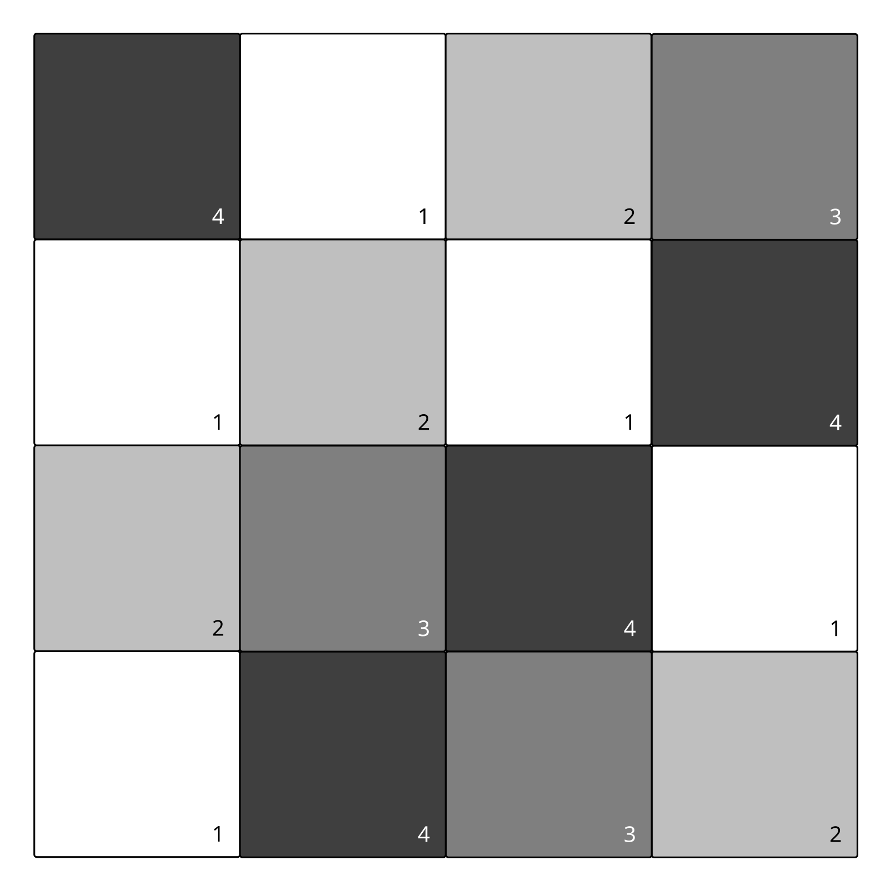
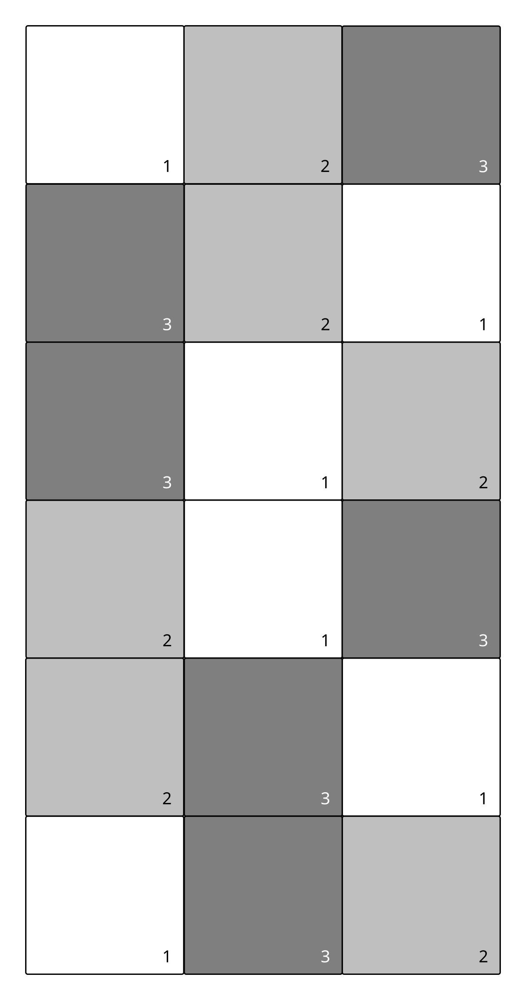
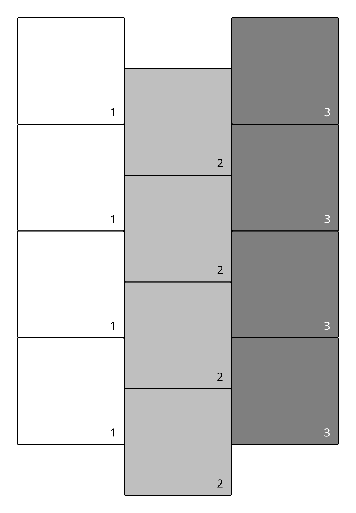
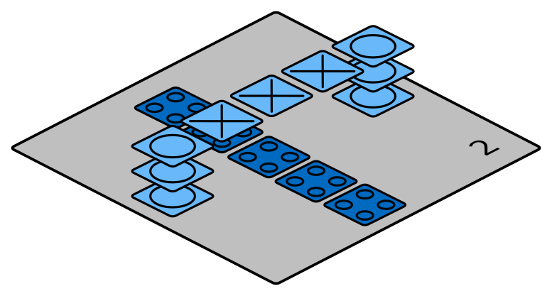
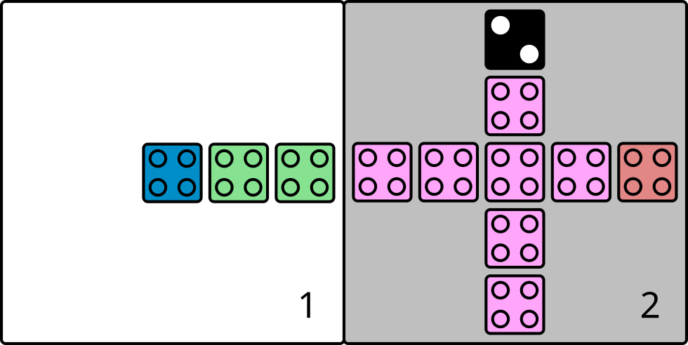
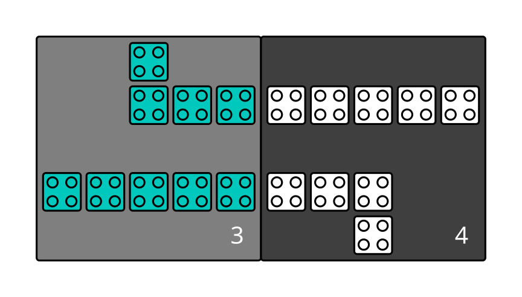
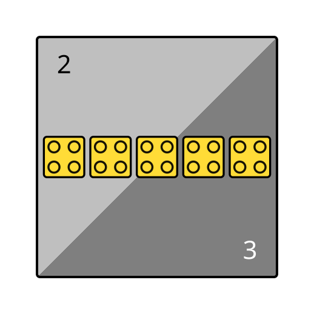
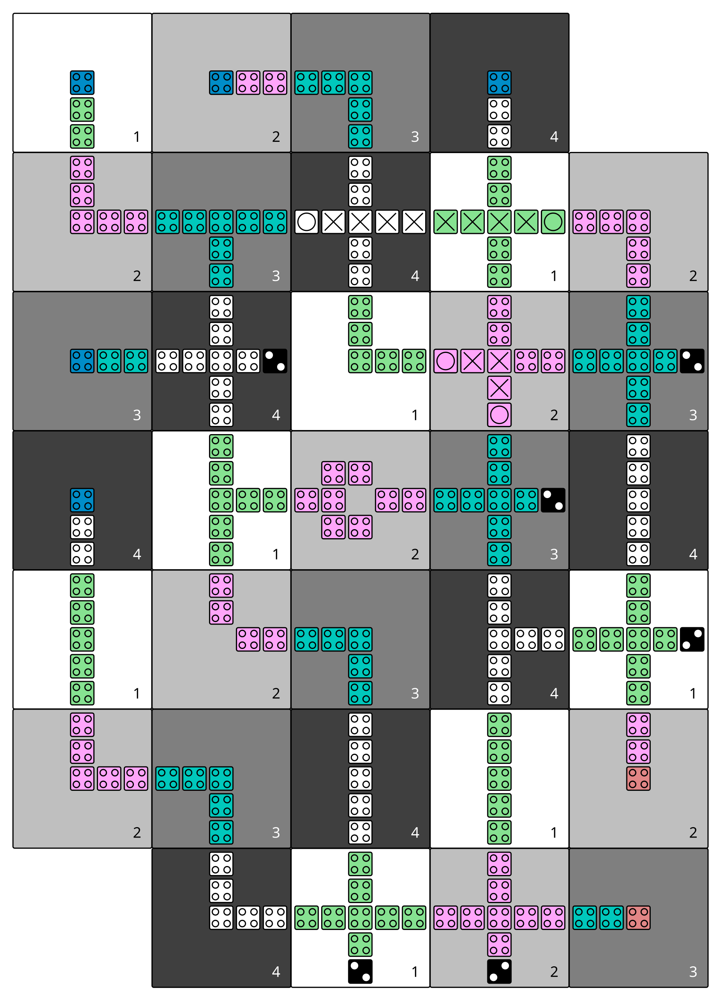
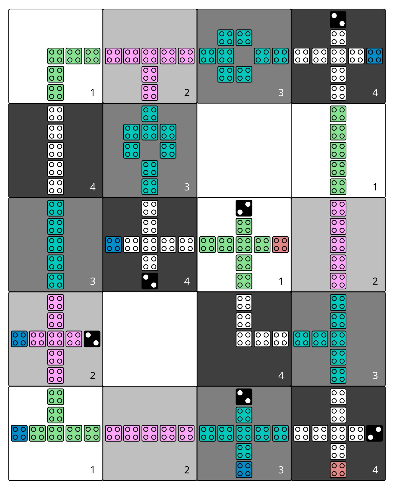

# Let there be a fiction

[](https://travis-ci.com/marcelwa/fiction)

This code base provides a framework for **fi**eld-**c**oupled **t**echnology-**i**ndependent **o**pen **n**anocomputing
in C++17 using the [EPFL Logic Synthesis Libraries](https://github.com/lsils/lstools-showcase). *fiction* focuses on the
physical design of emerging nanotechnologies. As a promising class of post-CMOS technologies,
[Field-coupled Nanocomputing (FCN)](https://www.springer.com/de/book/9783662437216) devices like Quantum-dot Cellular
Automata (QCA) in manifold forms (e.g. atomic or molecular), Nanomagnet Logic (NML) devices, and many more, allow for high
computing performance with tremendously low power consumption without the flow of electric current.

With ongoing research in the field, it is unclear, which technology will eventually be competing with CMOS.
To be as generic as possible, *fiction* is able to perform physical design tasks for FCN circuit layouts on a data
structure that abstracts from a particular technology or cell design. Using an extensible set of gate libraries,
technologies, and cell types, these can easily be compiled down to any desired FCN technology.

### Implemented physical design algorithms

Thus for, *fiction* provides two types of physical design approaches.

First, an [exact approach](https://ieeexplore.ieee.org/document/8342060)
([PDF](http://www.informatik.uni-bremen.de/agra/doc/konf/2018DATE_ExactMethodforDesignExplorationOfQCA.pdf)) determines
layouts which are optimal in terms of circuit area (by this, solving an [NP-hard problem](https://dl.acm.org/citation.cfm?id=3312661)
([PDF](http://iic.jku.at/files/eda/2019_jetc_placement_routing_field_coupled_nanocomputing_circuits_is_np_complete.pdf)) in
an exact fashion). The technique utilizes [Z3](https://github.com/Z3Prover/z3) by Microsoft Research, a solver for
Satisfiability Modulo Theories (SMT). While the approach is only feasible for small circuits, it generates the most compact layouts.
(See [SMT-based physical design](#smt-based-exact).)

Additionally, a [scalable method](https://dl.acm.org/citation.cfm?id=3287705)
([PDF](http://www.informatik.uni-bremen.de/agra/doc/konf/2019_ASP-DAC_Scalable_Design_for_Field-coupled_Nanocomputing_Circuits.pdf))
is implemented which is based on Orthogonal Graph Drawing (OGD). It has a huge runtime advantage compared to the exact approach.
Although the layouts generated by this approach are not optimal in terms of area, this technique is applicable even for larger
circuits and provides results in reasonable runtime. (See [OGD-based physical design](#ogd-based-ortho).)

This is ongoing research and more algorithms are to come!

### Supported technologies

Created layouts can be converted into QCA circuits using a slightly adjusted version of the
[QCA-ONE](https://ieeexplore.ieee.org/document/7538997/) gate library. Those can be written as files for the
[QCADesigner](https://waluslab.ece.ubc.ca/qcadesigner/) to run physical simulations. Also, [SVG graphics](#svg-export) can be
generated to quickly visualize created circuits.

Additionally, thanks to a cooperation with the Department of Electronics and Telecommunications at Politecnico di Torino,
first support for iNML circuits has been achieved. To enable integration with [ToPoliNano and MagCAD](https://topolinano.polito.it/),
the column-based clocking scheme and the custom gate library used in ToPoliNano are implemented alongside. Generated
iNML circuits can be written as QCC files for ToPoliNano and MagCAD to perform physical simulations. SVG visualization will
follow in a future update. 

## Design Features

To be as generic as possible regarding support for different technologies in its data types, *fiction* implements many design features
found in the literature. This section gives a quick overview.

### Tile-based vs. cell-based layouts

As [research suggests](https://www.mdpi.com/2079-9268/8/3/31), it might not be possible to apply external clocks to individual cells in
final (cell-based) layouts. Since clocking is crucial, that is why tile-based layouts are widely used where groups of cells forming logic
entities got the same clock assigned. Even though, tile-based layouts provide better abstraction from physics and more stable signals,
cell-based layouts are still used in many published papers right now. Hence, *fiction* uses tile-based layouts as its standard layout
datatype `fcn_gate_layout` but also supports cell-wise clocking in `fcn_cell_layout`. Furthermore, gate layouts can be compiled down
to cell based ones using an `fcn_gate_library` in a [physical synthesis](#physical-synthesis) step.

To support a new cell technology, a new refinement of `fcn_gate_library` must be implemented, and some adjustments to `port_router` need
to be done.

### Clocking schemes

There are highly regular clocking schemes proposed for FCN technologies which can be used as a floor plan for placement, routing, and
timing i.e. physical design. However, sometimes it can make sense to have more degree of freedom and assign clock numbers on the fly.
That is why *fiction* supports regular and irregular clocking schemes with variable amounts of clock numbers as QCA e.g. uses
four clock phases but iNML needs only three.

Built-in schemes are


| [2DDWave](https://ieeexplore.ieee.org/document/1717097) (3 or 4 phases) | [USE](https://ieeexplore.ieee.org/document/7219390) (4 phases) | [RES](https://www.tandfonline.com/doi/abs/10.1080/21681724.2019.1570551) (4 phases) | [BANCS](https://ieeexplore.ieee.org/document/8533251) (3 phases) |  [ToPoliNano](https://topolinano.polito.it/) (3 or 4 phases)  |
|:-----------------------------------------------------------------------:|:--------------------------------------------------------------:|:-----------------------------------------------------------------------------------:|:----------------------------------------------------------------:|:-------------------------------------------------------------:|
|                  |                 |                                      |               |  |

plus the mentioned irregular open clocking (3 or 4 phases) that works via a clock map instead of a regular extrapolated cutout.

More clocking schemes can be easily implemented by adjusting `fcn_clocking_scheme`.

### Wire crossings



With many FCN technologies considered planar, wire crossings should be minimized if possible. However, there are some options in QCA where,
using a second layer, crossings over short distances and co-planar rotated cells become possible. As both are just technical implementations
of the same concept, *fiction* supports crossings as wires in a second grid layer in its data structures. They will also be represented as
such in corresponding SVG and QCADesigner output. However, note that it is to be interpreted as the concept of crossings and could also be
realized co-planar.

Wires are only allowed to cross other wires! Wires crossing gates is considered to lead to unstable signals.

### Gate pins vs. designated I/Os



In the literature, both is seen: having input cells (pins) directly located in the gate structure or using designated I/O elements which are
located outside of gates. This distinction only makes sense on the gate-level and *fiction* supports both approaches and offers usage in
all implemented physical design algorithms.

### Multi wires



Gate-level abstraction has its limits. Often, chip area is wasted when only using a single wire per tile. In *fiction*, data types support
the use of arbitrarily many wire elements per tile in theory. If the resulting circuit should be compiled down to cell-level, an
`fcn_gate_library` with respective tile dimensions which can handle that many wires is required. Discussion in literature is still
ongoing if multi wires can be supported by physics which is why making physical design algorithms incorporating them is not a top priority
right now. However, feel free to change that.

### Synchronization elements



When using the external clocks in smart ways, artificial [synchronization elements](https://ieeexplore.ieee.org/document/8626294)
([PDF](http://www.informatik.uni-bremen.de/agra/doc/konf/2018NANO_SynchronizationOfClockedFieldCoupledCircuits.pdf)) can be created that
hold signals longer and therefore forming latches and even overcome local clock synchronization issues in final designs. By elongating the
the *Hold* phase of certain tiles, information is stalled in those tiles for some phases. This requires an additional external clock but
can gain several benefits. As mentioned, those tiles can form latches when holding signals by a multiple of *n* phases, where *n* is the
clock number in the design (e.g. 4 for QCA). When holding the signals for any *m* that is *not* a multiple *n*, the information flow
changes and therefore one can
[ignore local clock synchronization issues](https://ieeexplore.ieee.org/document/8839546)
([PDF](http://www.informatik.uni-bremen.de/agra/doc/konf/2019_ISVLSI_Ignore_Clocking_Constraints_An_Alternative_Physical_Design_Methodology_for_Field-coupled_Nanotechnologies.pdf)).

These clock latches are ready for use in *fiction* and are supported by the [exact physical design approach](#smt-based-exact).

### Cost metrics

Designed layouts can be evaluated with regard to several cost functions. Some are substantial and can be printed directly, others will be
logged only if desired. The following metrics are currently implemented:

Gate-level layouts:

- Circuit dimension in tiles
- Number of gate tiles
- Number of wire tiles
- Number of wire crossings
- Number of clock latches ([synchronization elements](#synchronization-elements))
- Critical path
- Throughput
- Bounding box of non-free tiles
- Energy dissipation based on a [physical model](https://ieeexplore.ieee.org/document/8246526) (QCA only)

Cell-level layouts:

- Circuit dimension in cells
- Number of cells

Learn more about [benchmarking and scripting](#benchmarking-and-scripting).

### Logic synthesis

*fiction* focuses on physical design, i.e. placement, routing, and timing, of circuits and takes logic synthesis for granted. As
described [later](#preface), the tool [ABC](https://github.com/berkeley-abc/abc) for example could be used to generate synthesized
logic networks which can be entered in *fiction* as circuit specifications.

However, *fiction* makes use of the logic network library [mockturtle](https://github.com/lsils/mockturtle) by Mathias Soeken which
comes with various logic synthesis and optimization algorithms. The reader might feel free to make use of them prior to physical
design in order to obtain optimized layouts.

The `mockturtle` library is also used to provide functionality for generating networks from truth tables as well as random networks. 
See the section about [logic networks](#circuit-specifications-in-terms-of-logic-networks) for more information about network
generation and manipulation.

## Docker

Docker can be used to build an image to run *fiction* or to use it for development purposes on Windows and Linux. Make sure you have [Docker](https://www.docker.com/) installed and if you are on Windows, that you switched to Linux containers.

If Docker is set up correctly you can download the [Dockerfile](https://github.com/marcelwa/fiction/blob/master/Dockerfile) and build the image, which automatically clones the repository and builds fiction. After the download, change to the directory which contains the Dockerfile and build it with 

```sh
docker build .
```

This can take a while, as it downloads the necessary alpine image file, build tools, clones the repository and builds fiction. Especially building z3 can take a while. If everything finishes successfully, you can get the ID of your newly created image with the command

```sh
docker images
```

Then you can run your image interactively with the following command, where {Image-ID} has to be replaced with your ID.

```sh
docker run -it {Image-ID}
```
This starts the image in a new container and automatically launches *fiction*, which waits for commands. You can quit with the command `quit`. If you don't want to automatically start *fiction* and instead connect via shell, use the following command

```sh
docker run -it {Image-ID} /bin/sh
```

You will be in the directory `/fiction` which contains the git repository and in the directory `fiction/build` are all build files and the *fiction* executable. 

Once the container is created, you shouldn't run the image every time you use it, since this always creates a new container. Instead, just reuse the already created container. You can see your docker containers with the command

```sh
docker ps -a
```
And then start a container and attach to it with the command

```sh
docker start -ai {Container-ID}
```

Depending on what `run` command you used, this may or may not automatically start *fiction*. You can use the same parameter with `docker start` as with `docker run` to switch between shell and *fiction*.

You can also use the container for development purposes, which depends on how you are used to develop with containers. One way would be to use Visual Studio Code with the Remote-Containers extension. You can either attach Visual Studio Code to an already running container, if you used the previous steps (make sure the container is running, to do this check if the container is listed when you enter `docker ps`, if not, start it first with `docker start {Container-ID}`) or you can let Visual Studio Code build its own container. For further information, look at [Developing inside a Container](https://code.visualstudio.com/docs/remote/containers).

## Building process

Git, g++, cmake and the Boost libraries are necessary in order to build *fiction*. Since a Python interpreter and
GNU readline are utilized by some dependencies, it is also recommended to set them up.

When checking out this repository, make sure to also clone all submodules by using

```sh
git clone --recursive
```

Several third-party libraries will be cloned within the `libs` folder. The `cmake` build process will take care of
them automatically. Should the repository have been cloned before,

```sh
git submodule update --init --recursive
```

will fetch the latest version of all external modules used.

Afterwards, *fiction* is ready to be built.

### Linux (Ubuntu)

Use this command to install all necessary libraries.

```sh
sudo apt-get install git g++ cmake libboost-all-dev python libreadline-dev
```

Note that there is no guarantee that a system does not lack some required packages which are not listed here!
CMake will print information about missing dependencies during the build process. Simply enter the following commands:

```sh
cd fiction
mkdir build
cd build
cmake ..
make
```

This process may take a while!

One have the choice to change the `cmake` call to `cmake -DCMAKE_BUILD_TYPE=Debug ..` if building with debug
information is preferred. The build mode can also be toggled via the `ccmake` CLI. Note that building with
debug information will have a significant negative impact on *fiction*'s runtime!

### Windows Subsystem for Linux (WSL)

To build *fiction* on Windows, WSL has to be installed. Instructions can be found on
[the official Windows page](https://docs.microsoft.com/en-us/windows/wsl/install-win10). During installation, it is highly
recommended to pick *Ubuntu* as the Linux distribution. Then, simply follow the build steps listed above on the WSL.

If one wants to use [Visual Studio](https://visualstudio.microsoft.com/de/) (VS) to work with the source code, have a look at
how to [Target WSL from VS](https://devblogs.microsoft.com/cppblog/targeting-windows-subsystem-for-linux-from-visual-studio/),
[Cross Platform C++ with VS](https://devblogs.microsoft.com/cppblog/using-visual-studio-for-cross-platform-c-development-targeting-windows-and-linux/),
and [CMake with VS](https://docs.microsoft.com/en-us/cpp/linux/cmake-linux-project?view=vs-2017).

#### Troubleshooting while using the WSL

If one cannot install `libboost-all-dev` (the error might look like this: `Unable to locate package libboost-all-dev`) 
it should be fixed by adding `universe` to the repositories and trying again:

```sh
sudo add-apt-repository universe
sudo apt-get update
sudo apt-get install libboost-all-dev
```

Note that it is possible that *alice* does not find the readline-library even though it is 
installed. CMake will print information about this with a warning: 
```
CMake Warning at libs/alice/include/CMakeLists.txt:35 (message):
  Cannot find readline library, fall back to native interface.
```
There is no solution to this as of now and it may lead to missing tab-completion while interacting with *fiction*.

### Visual Studio (MSVC)

***Disclaimer**: fiction was developed for Linux. Unexpected behavior might occur during an MSVC build or execution
of the resulting binary as this mode is not fully tested (but it could be made working with MSVC 14.16).
Apologies for any inconveniences you might face.*

Make sure you have CMake set up in Visual Studio and Boost and Python installed on your system.

Open a Visual Studio Command Prompt and navigate to `fiction\libs\z3`. Type

```batch
python scripts\mk_make.py
```

Add `-x` for 64-bit builds. Then enter

```batch
cd build
nmake
```

This process builds Z3 and might take a while. Afterwards, the CMake process can be triggered in Visual Studio.
Note that it can happen that the Boost Libraries are not detected correctly. In this case, two new CMake variables
can be defined to point CMake towards the installation directory. Simply add

```
-DBoost_CUSTOM_INCLUDE_DIRS=<include_path>
-DBoost_CUSTOM_LIBRARY_DIRS=<library_path>
```

as arguments to the CMake call.

Set `fiction.exe` as build target and run the build process. Note that it might be necessary to copy Boost DLLs into
your build folder. Windows will inform you about missing DLLs when executing *fiction*.

## Using the command line interface (CLI)

The [building process](#building-process) generates an executable called `fiction`. A simple non-exhaustive workflow
is described in the following. To get some information about the available commands, run `fiction` with a help flag:

```sh
./fiction --help
```

Starting the interactive mode by entering `fiction` greets the user with a prompt. Again, input of `help` produces a
list of available commands. One can generate a plain text full documentation by entering `help --docs <filename>`. 

### Preface

*fiction* utilizes the CLI [alice](https://github.com/msoeken/alice) by Mathias Soeken. It provides a flexible
store-based architecture. A store for logic networks holds specifications which then can be transformed into
FCN circuit layouts. Specifications can be provided in terms of synthesized structural Verilog netlist files using
`assign` statements and Boolean primitives or combinational AIGER files. Using the tool
[ABC](https://github.com/berkeley-abc/abc) for example, such files can be generated by

```sh
read spec.bench
strash
write spec.v
write spec.aig
```

ABC supports numerous file formats from which `.bench` is just an example one. *fiction* also comes with a lot of preset
netlists in the `benchmarks` folder.

### Stores

Stores hold data structures obtained by parsing, designing, or compiling. There are stores for

- `truth_table` (`-t`)
- `logic_network` (`-n`)
- `fcn_gate_layout` (`-g`)
- `fcn_cell_layout` (`-c`)

objects. Several generic commands typed in interactive mode work on different kinds of stores and therefore need to be
given a store flag as specified by the list above. Applicable commands are for instance

- `store`: prints a brief listing of the contained elements
- `current <n>`: changes the active store element to element number `<n>` (otherwise the newest entry is active)
- `ps`: prints statistical data and cost metrics of the active store element
- `print`: prints a textual representation of the store element to the standard output
- `show`: displays a visual representation of the store element with the user's standard viewer (`.dot` for `-n`, `.svg` for `-c`)

For an exhaustive overview of available commands, see the full [alice documentation](https://libalice.readthedocs.io/en/latest/index.html).

### Circuit specifications in terms of logic networks

As mentioned before, `logic_network` objects parsed from some Verilog or AIGER file serve as specifications for FCN
circuits to be designed. In other words, `logic_network` objects are to be mapped onto grid-like structures under
FCN constraints.

When in *fiction*'s interactive mode, one can enter `read <filename>` to read a logic network into a store or
`read <directory>` to parse all parsable files within that given directory powered by the
[lorina](https://github.com/hriener/lorina) parser by Heinz Riener respectively. The flag `-s` allows prior sorting.
The content of the logic network store can be briefly viewed by entering `store -n`. A more detailed breakdown can be
printed by command `gates`. Command `show -n` writes a [Graphviz](https://www.graphviz.org/) `.dot` file of the
current network and opens it with the user's standard viewer (like e.g. [xdot](https://github.com/jrfonseca/xdot.py)).

#### Truth tables

The `truth_table` store (`-t`) can hold logic descriptions in binary format as implemented in the `kitty` library
by Mathias Soeken. These can either be loaded via command `tt` by specifying a bit/hex string or a Boolean expression,
or be obtained by [simulating](#logical-simulation-simulate) a `logic_network` or `fcn_gate_layout` via command
`simulate`. Generating a `truth_table` from an expression uses the following syntax (from the
[kitty documentation](https://libkitty.readthedocs.io/en/latest/reference.html#_CPPv4I0EN5kitty22create_from_expressionEbR2TTRKNSt6stringE)).

An expression `E` is a constant `0` or `1`, or a variable `a, b, ..., p`, the negation of an expression `!E`, the
conjunction of multiple expressions `(E...E)`, the disjunction of multiple expressions `{E...E}`, the exclusive OR of
multiple expressions `[E...E]`, or the majority of three expressions `<EEE>`. Examples are `[(ab)(!ac)]` to describe
if-then-else, or `!{!a!b}` to describe the application of De Morgan’s law to `(ab)`. The size of the truth table must
fit the largest variable in the expression, e.g., if `c` is the largest variable, then the truth table has at least
three variables.

Alternatively, `tt 0110` or `tt 0xaffe` generate `truth_table`s from bit/hex strings.

#### Logic synthesis

Having a `truth_table` in store, the command `akers` generates an equivalent Majority `logic_network` using Akers' synthesis.

Furthermore, it is possible to generate random `logic_network`s by using command `random`. The desired number of primary
inputs can be specified (`-n`) as well as the gate count excluding inverters and fan-outs (`-g`). A random seed (`-s`)
allows for reproducibility as it will also be used as the network`s name.

#### Structural manipulation

As known from the literature, some physical design approaches balance `logic_networks` prior to the actual placement. This is
also possible in *fiction* using command `balance`. However, it is not recommended as this will blow-up the resulting layout
size tremendously. So far, the implemented physical design algorithms do not make use of balanced networks.

Besides, command `fanouts` enables the user to specify strategies when substituting high-degree connections into fan-out nodes.
For instance, `fanouts -d 3 -s 1` allows 3-output fan-out nodes and substitutes cascading fan-outs in a depth-first fashion. 
This is done with default settings by the physical design approaches if not specified by the user.

### Physical design

The above mentioned exact (SMT-based) and scalable (OGD-based)
[implemented physical design algorithms](#implemented-physical-design-algorithms) can be called on the currently active
`logic_network` in store by `exact` and `ortho` respectively. Find some information and parameters about them below.

Generated FCN gate layouts are also saved in stores. Entering `store -g` shows a list of all gate layouts available.
Statistical information about store elements can be printed using command `ps -g` and could produce the following output.

```
 c17 - 5 × 7, #G: 18, #W: 18, #C: 3, #L: 0, CP: 11, TP: 1/1
```

This displays (from left to right) the name of the layout, the dimension in tiles, the number of gate tiles (including
designated I/O pins and fan-outs), wire elements, crossings, latches
([synchronization elements](https://ieeexplore.ieee.org/document/8626294),
[PDF](http://www.informatik.uni-bremen.de/agra/doc/konf/2018NANO_SynchronizationOfClockedFieldCoupledCircuits.pdf)),
the length of the critical path, and the throughput of the design (where 1/1 is maximum throughput).

#### SMT-based (`exact`)

Satisfiability Modulo Theories (SMT) is used to describe the physical design problem in first-order logic. The SMT solver
engine [Z3](https://github.com/Z3Prover/z3) is then used to extract a satisfiable model from the resulting formula
which is then translated back into a valid solution to the original physical design problem. For more information,
see [the paper](https://ieeexplore.ieee.org/document/8342060)
([PDF](http://www.informatik.uni-bremen.de/agra/doc/konf/2018DATE_ExactMethodforDesignExplorationOfQCA.pdf)).

This exact approach generates minimal layouts in terms of circuit area. Since determining minimal FCN circuits for given
specifications is an [NP-hard problem](https://dl.acm.org/citation.cfm?id=3312661)
([PDF](http://iic.jku.at/files/eda/2019_jetc_placement_routing_field_coupled_nanocomputing_circuits_is_np_complete.pdf)),
the process takes a while and is only suitable for rather small benchmarks with just a few gates.

On the other hand, this approach is highly parameterizable and can produce results for a variety of settings.
The most important ones are

- Define the used clocking scheme (`-s ...`)
- Enable wire crossings (`-x`)
- Enable designated I/O ports (`-i`)
- Route all I/Os to the layout's borders (`-b`)
- Allow artificial clock latches (`-a`)
- Allow for de-synchronized circuits (`-d`)

See `exact -h` for a full list.

#### OGD-based (`ortho`)

Orthogonal Graph Drawing (OGD) is a well known problem in graph theory that remarkably resembles the physical design
problem for tile-based FCN circuits. Even though the problem of determining minimal drawings is hard in general, there
exist linear time approximations for 3-graphs. Luckily, AOIGs can be substituted until they are 3-graphs. Using a
topological ordering and a certain direction assignment, even large circuits can be designed in reasonable runtime.
For more information, see [the paper](https://dl.acm.org/citation.cfm?id=3287705)
([PDF](http://www.informatik.uni-bremen.de/agra/doc/konf/2019_ASP-DAC_Scalable_Design_for_Field-coupled_Nanocomputing_Circuits.pdf)).

This scalable approach only works on logic networks which are AOIGs (MAJ gates do not work). The clocking scheme is fixed to
[2DDWave](https://ieeexplore.ieee.org/document/1717097) and the algorithm can only be slightly parameterized
(see `ortho -h`).

### Design rule checking (`check`)

Physical integrity of designed circuits can be verified using command `check`. It triggers a design rule checker which
tests various topological and structural properties of the layout, logs all discrepancies, and outputs a summary report.
The design rule checker especially aims at structurally verifying layouts that were generated with custom algorithms to
find bugs quickly.

### Logical simulation (`simulate`)

If an `fcn_gate_layout` has been created with designated I/O pins (flag `-i` in `exact` and `ortho`), its functionality can
be simulated on a logic level. Command `simulate -g` traces all paths on the current gate layout in store respecting clocking
and [synchronization elements](#synchronization-elements). To this end, truth tables for each output are generated. Note that
this functionality not just simulates the associated logic network, but investigates the layout structure. A `logic_network`
can also be simulated for comparison by using `simulate -n`.

Timing information, and thereby global synchronization, is not respected here. Use `ps -g` to get details about the layout's
throughput (TP) and thereby, the amount of clock cycles the PIs need to be stalled to generate the simulated outputs. 

### Physical synthesis (`cell`)

As mentioned above, gate-level layouts can be compiled down to cell-level ones in a physical synthesis step. An
`fcn_gate_library` is required to do so. The command `cell` does exactly this, where the `-l` option indicates the gate
library to use. `-l 0` represents [QCA-ONE](https://ieeexplore.ieee.org/document/7538997/) which is the default
setting, `-l 1` refers to [ToPoliNano](https://topolinano.polito.it/)'s gate library for iNML circuits. Note that only
`exact` can be used in the moment to create layouts mappable to iNML. Suggested parameters are `exact -xinbs topolinano3`.
Cell-based layouts are also saved in stores which can be accessed by typing `store -c`. Due to significantly larger size of
cell layouts compared to gate layouts, the `print -c` command to write layouts to the terminal should be used
carefully. See [SVG export](#svg-export) instead.

Nevertheless, one can use `qca <filename>` to create a [QCADesigner](https://waluslab.ece.ubc.ca/qcadesigner/) file and
`qcc <filename>` to create a file usable by ToPoliNano and MagCAD for running physical simulations. If no filename is
given, the stored layout name will be used and the file will be written to the current folder.

### SVG export (`show -c`)

QCA cell-level layouts can be exported as scalable vector graphics (`.svg` files) using the command `show -c`. This will
immediately open the standard SVG program immediately to give a more sophisticated visual representation of the
current cell layout in store. If one wants to just generate the SVG file without opening it in the standard viewer,
`show -c <filename>.svg --silent` can be used.

Alternatively, open the exported file with a different program by using `show -c --program "\"google-chrome\" {}"` for
instance to open it with the Chrome browser. Note that this behavior is platform-dependent and might not properly work
under every system. For more information see `show -h` or the full
[alice documentation](https://libalice.readthedocs.io/en/latest/index.html).

The used color scheme is based on the one known from [QCADesigner](https://waluslab.ece.ubc.ca/qcadesigner/).

There is also an option for showing a simple version of cells that leaves out the quantum dots and clock zone numbers.
This makes the exported files significantly smaller, especially for large layouts. The corresponding flag is `-s`.

SVG output for iNML circuits is being worked on and will follow in a future update.

### Benchmarking and scripting

All design steps explained in the previous sections can also be specified within a single *fiction script* file like
the following called `c17_synth.fs`

```sh
read ../benchmarks/ISCAS85/c17.v
exact -xibs 2ddwave4
ps -g
cell
show -c
exact -ds use
ps -g
cell
show -c
```

which can be executed by `./fiction -ef c17_synth.fs -l c17_log.json` where statistics are to be logged in a JSON file
called `c17_log.json`.  The following table presents the results.

| `exact -xibs 2ddwave4`                                               |  `exact -ds use`                                                |
|:--------------------------------------------------------------------:|:---------------------------------------------------------------:|
|  |    |
| ```c17 - 5 × 7, #G: 18, #W: 18, #C: 3, #L: 0, CP: 11, TP: 1/1```     | ```c17 - 4 × 5, #G: 11, #W: 7, #C: 0, #L: 0, CP: 13, TP: 1/3``` |


These scripts can also be nested. One can use `< script.fs` within a *fiction script* to load `script.fs` in that very position.
A script called `shortcuts.fs` has been placed in the top level folder. It can be loaded on start-up by calling
`./fiction -if ../shortcuts.fs` in the build folder. This makes predefined commands and flows available as shortcuts.
Try `synth xibs use` for instance to perform the whole flow of design (utilizing `USE` clocking) and physical
synthesis down to cell-level including visual representation.

Additionally, *fiction* itself can be part of a bash script. Consider the following snippet

```sh
for filepath in ../benchmarks/TOY/*.v; do
    f="${filepath##*/}"
    ./fiction -c "read $filepath; ortho; cell; qca ${f%.*}.qca"
done
```

where the for-loop iterates over all Verilog files in the `../benchmarks/TOY/` folder. Using the flag `-c`, a
semicolon-separated list of commands can be entered in *fiction*. In this case, the files are to be read in a store,
designed using the `ortho` algorithm, synthesized to cell-level, and written as QCA using their original file
name.

## Uninstall

Since all tools were built locally, simply delete the git folder cloned initially to uninstall this project.

## References

A brief technical report summarizing the features of *fiction* is available at [arXiv](https://arxiv.org/abs/1905.02477).

If you use *fiction* in your work, I would appreciate if you cited

> Marcel Walter, Robert Wille, Frank Sill Torres, Daniel Große and Rolf Drechsler: "fiction: An Open Source Framework
> for the Design of Field-coupled Nanocomputing Circuits", 2019, **arXiv:1905.02477**.

```tex
@misc{fiction,
  author = {Marcel Walter and Robert Wille and Frank Sill Torres and Daniel Gro{\ss}e and Rolf Drechsler},
  title = {{fiction: An Open Source Framework for the Design of Field-coupled Nanocomputing Circuits}},
  archivePrefix = {arXiv}, 
  eprint = {1905.02477},
  year = {2019},
  month = {May}
}
```

The [paper](./bib/paper.pdf) and an overview [poster](./bib/poster.pdf) are also shipped with this repository.

Furthermore, if the aforementioned physical design techniques are helpful for you, please find corresponding
citations for the [exact approach](https://ieeexplore.ieee.org/document/8342060)
([BibTeX](https://scholar.googleusercontent.com/scholar.bib?q=info:4sV4HLtAl5MJ:scholar.google.com/&output=citation&scisig=AAGBfm0AAAAAXNVeLMDWESEscPWEEn-IZ3Cg_8q9ph6i&scisf=4&ct=citation&cd=-1))
and the [scalable method](https://dl.acm.org/citation.cfm?id=3287705)
([BibTeX](https://scholar.googleusercontent.com/scholar.bib?q=info:q_5SZf8jCP0J:scholar.google.com/&output=citation&scisig=AAGBfm0AAAAAXNVeTetPuxrHHCntTQFhw0TaYhjIIIYP&scisf=4&ct=citation&cd=-1))
online.

The *fiction* framework is part of my PhD Thesis entitled "Layout of Large Scale Field-coupled Nanocomputing Circuits"
(working title). Please find my publication list [here](http://www.informatik.uni-bremen.de/agra/eng/pub.php?search=Marcel%20Walter).

## Acknowledgments

I would like to thank my co-authors for countless helpful discussions and support with this framework. Also, I thank
Gregor Kuhn for implementing the SVG export and for reporting troublesome bugs, Mario Kneidinger for code
contributions, pointing out the Visual Studio resources and documentation inconsistencies on my side, and Till Schlechtweg for reporting bugs.
I thank Umberto Garlando who traveled hundreds of kilometers to explain his work to me and without whom, the iNML implementation would not have been possible.
Also, I thank Mathias Soeken for letting me use parts of his code and for his patience answering dozens of my technical questions.

Last but not least, I thank the committee of the ISVLSI 2019 for decorating *fiction* with the **Best Research Demo Award**. A
[press release](https://www.dfki.de/web/news/detail/News/mehr-als-nur-fiktion-entwurfswerkzeug-fuer-nanotechnologie-fiction-mit-best-research-demo-award-ausg/)
(in German) is available.

## Disclaimer

This is academic software made available under the CRAPL license. For more information see the LICENSE file.
